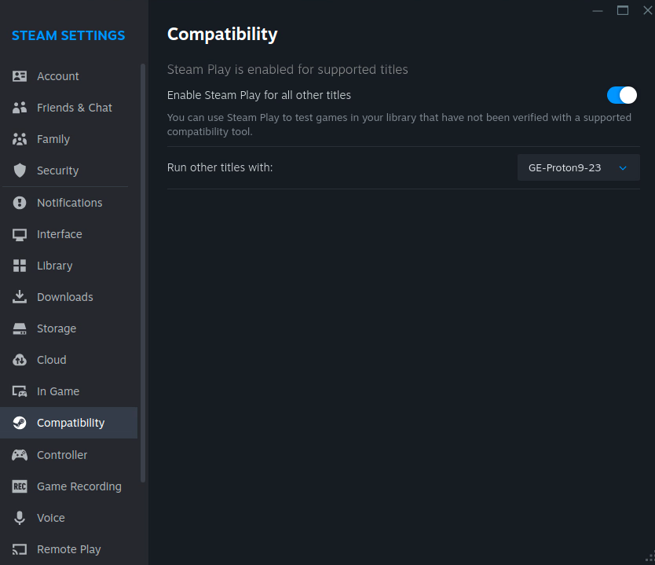
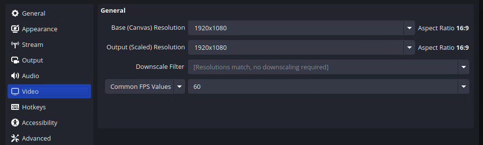
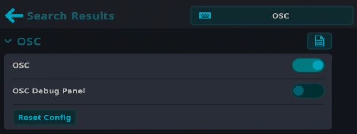

# PAMIQ VRChat

Interface for PAMIQ to interact with VRChat on Linux.

## ✨ Features

- **Visual Input**: Capture VRChat gameplay through OBS virtual camera with the `ImageSensor`
- **Mouse Control**: Simulate mouse movements and clicks with natural-feeling transitions using `MouseActuator` and `SmoothMouseActuator`
- **Avatar Control**: Send OSC commands to VRChat for avatar movement, jumping, and actions via `OscActuator` and `SmoothOscActuator`
- **Modular Design**: Easily compose sensors and actuators into a complete `VRChatEnvironment`
- **Smooth Transitions**: Natural-feeling controls with gradual acceleration and realistic button timings
- **PAMIQ Integration**: Seamlessly works with PAMIQ-Core for AI agent development

## 📦 Installation

> \[!NOTE\]
> If **🐧 Linux** user, install [**inputtino**](https://github.com/games-on-whales/inputtino/tree/stable/bindings/python#installation) which is a required dependency.

```sh
# Install via pip
pip install pamiq-vrchat

# Install from source
git clone https://github.com/MLShukai/pamiq-vrchat.git
cd pamiq-vrchat
pip install .
```

## 🛠️ Setup VRChat Environment

### Prerequisites

- Linux or Windows machine.
- Machine capable of running VRChat

### Install Steam

Download and install Steam from the [official website](https://store.steampowered.com/about/).

### **(🐧Linux User Only)** Enable Proton

Open Steam → Settings → Compatibility and enable `Enable Steam Play for all other titles`.



#### (Optional) Install Proton GE

If you want to use video players in VRChat on Linux, install [Proton GE](https://github.com/GloriousEggroll/proton-ge-custom?tab=readme-ov-file#installation).

After installation, select `GE-Proton` as the compatibility tool in Steam → Settings → Compatibility under `Run other titles with:`.

### Install VRChat

Add **VRChat** to your library from the [Steam store](https://store.steampowered.com/app/438100/VRChat/) and install it.

After install, launch VRChat and login.

### Setup OBS

For OBS installation and virtual camera setup, refer to [pamiq-io documentation](https://github.com/MLShukai/pamiq-io?tab=readme-ov-file#obs-virtual-camera).

> \[!NOTE\]
> The `Output (Scaled) Resolution` and `FPS Value` in OBS Video settings will affect the output of the `ImageSensor` class.
> 

Capture the VRChat window in OBS and enable the virtual camera.

You can also use our pre-configured [Scene Collection](./obs_settings/). Import it from the OBS `Scene Collection` tab → `Import`, and ensure the checkbox is checked.

### Enable OSC

1. Open the "Launch Pad" (press the `Esc` key)
2. Go to the main menu
3. Open settings (click the ⚙️ icon)
4. Click `Search all settings` and type "OSC", then press Enter
5. Enable the `OSC` button



## 🚀 Quick Examples

### Image Sensor

```python
from pamiq_vrchat.sensors import ImageSensor

# Connect to OBS virtual camera automatically
sensor = ImageSensor()
# Or specify a camera index
# sensor = ImageSensor(camera_index=0)
# (Windows only) you can specify width and height
# sensor = ImageSensor(width=1920, height=1080)

# Capture a frame
frame = sensor.read()
# frame is a numpy array with shape (height, width, channels)
```

### Mouse Control

> \[!NOTE\]
> When using mouse control, remember to keep the VRChat game window focused (selected) on your desktop.

```python
from pamiq_vrchat.actuators import MouseActuator, MouseButton, SmoothMouseActuator

# Basic mouse control
mouse = MouseActuator()
# Move mouse at 100 pixels/sec horizontally, 50 pixels/sec vertically
mouse.operate({"move_velocity": (100.0, 50.0)})
# Click the left button
mouse.operate({"button_press": {MouseButton.LEFT: True}})
# Release the left button
mouse.operate({"button_press": {MouseButton.LEFT: False}})

# Smooth mouse control with gradual acceleration and natural-feeling clicks
smooth_mouse = SmoothMouseActuator(
    delta_time=0.05,     # Update interval
    time_constant=0.2,   # Movement smoothing
    press_delay=0.05,    # Button press delay
    release_delay=0.1    # Button release delay
)
smooth_mouse.operate({"move_velocity": (100.0, 50.0)})
```

### OSC Avatar Control

```python
from pamiq_vrchat.actuators import OscActuator, OscAxes, OscButtons, SmoothOscActuator

# Basic OSC control
osc = OscActuator()
# Move forward
osc.operate({"axes": {OscAxes.Vertical: 1.0}})
# Jump
osc.operate({"buttons": {OscButtons.Jump: True}})
# Move forward while running
osc.operate({
    "axes": {OscAxes.Vertical: 1.0},
    "buttons": {OscButtons.Run: True}
})

# Smooth OSC control for more natural movement
smooth_osc = SmoothOscActuator(
    delta_time=0.05,     # Update interval
    time_constant=0.2,   # Axis value smoothing
    press_delay=0.05,    # Button press delay
    release_delay=0.1    # Button release delay
)
smooth_osc.operate({"axes": {OscAxes.Vertical: 0.5}})
```

### Complete VRChat Environment

```python
from pamiq_vrchat import ActionType, ObservationType, VRChatEnvironment
from pamiq_vrchat.sensors import ImageSensor
from pamiq_vrchat.actuators import SmoothMouseActuator, SmoothOscActuator

# Create sensors and actuators
image_sensor = ImageSensor()
mouse_actuator = SmoothMouseActuator()
osc_actuator = SmoothOscActuator()

# Create the VRChat environment
environment = VRChatEnvironment(
    sensors={
        ObservationType.IMAGE: image_sensor
    },
    actuators={
        ActionType.MOUSE: mouse_actuator,
        ActionType.OSC: osc_actuator
    }
)

# Get observations
observations = environment.observe()
image_frame = observations[ObservationType.IMAGE]

# Send actions
environment.affect({
    ActionType.MOUSE: {"move_velocity": (0, 0)},
    ActionType.OSC: {
        "axes": {OscAxes.Vertical: 0.5},
        "buttons": {OscButtons.Jump: True}
    }
})
```

## 🤝 Contributing

See our [Contributing Guide](CONTRIBUTING.md) for details on how to set up the development environment and contribute to the project.

## 📄 License

This project is licensed under the MIT License - see the [LICENSE](LICENSE) file for details.
